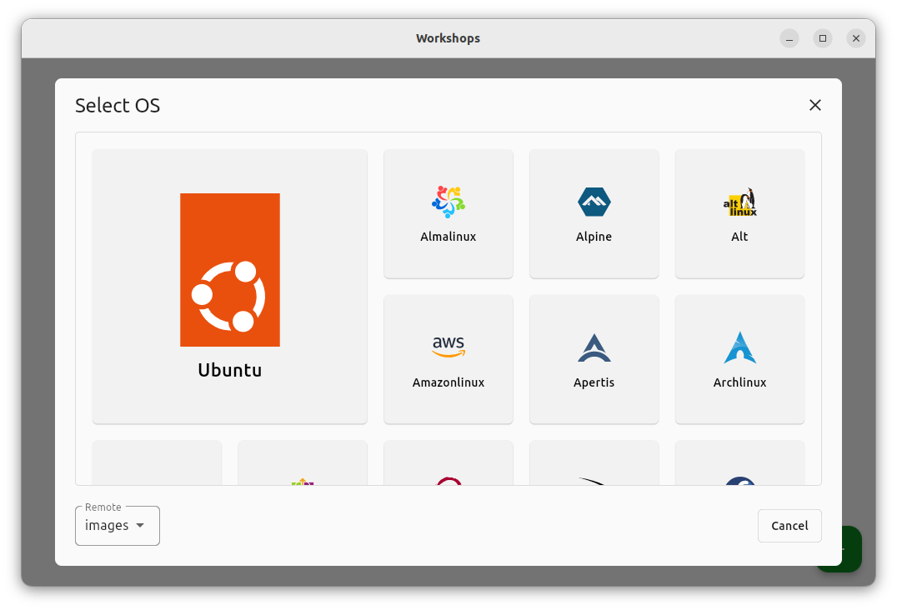
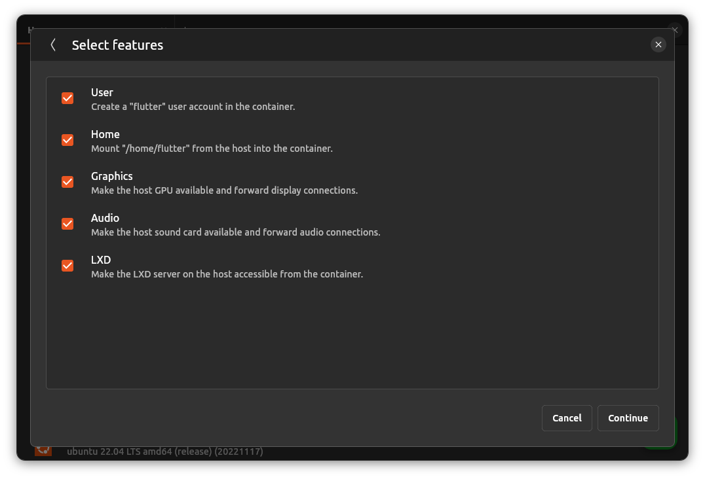
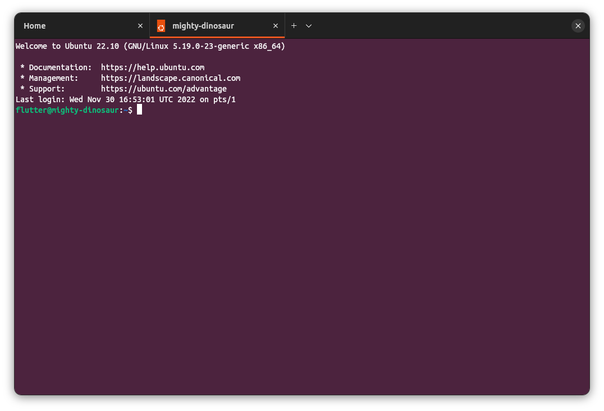

# Workshops

Workshops provides a user friendly interface to create and manage LXD containers
as well as provides a full featured terminal.

### Translations

Workshops is being translated using [Weblate](https://hosted.weblate.org/engage/workshops/), a web tool designed to ease translating for both developers and translators.
